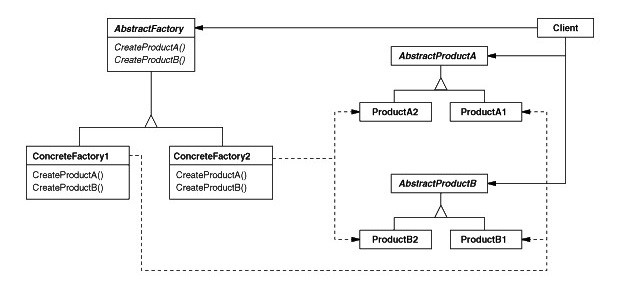

# Abstract Factory pattern

## Objetivo

Fornecer uma interface para criar famílias de objetos relacionados ou dependentes sem especificar suas classes concretas.

Cada tipo de Factory corresponde a uma determinada variedade de objetos.

Como uma fábrica corresponde a uma única variante de objeto, todos os seus objetos serão compatíveis.

## Funcionamento

- Declarar a interface para todos os tipos de produto. Fazendo com que todas as classes de produtos implementem essa interface.

- Declarar a interface da Factory com os métodos de criação para todos os produtos abstratos.

- Implementar o conjunto de classes Factory, uma para cada variante de produto.

- Criar a inicialização da factory. Ela deve instanciar uma das classes de fábrica concretas. Passe este objeto de fábrica para todas as classes que constroem produtos.

