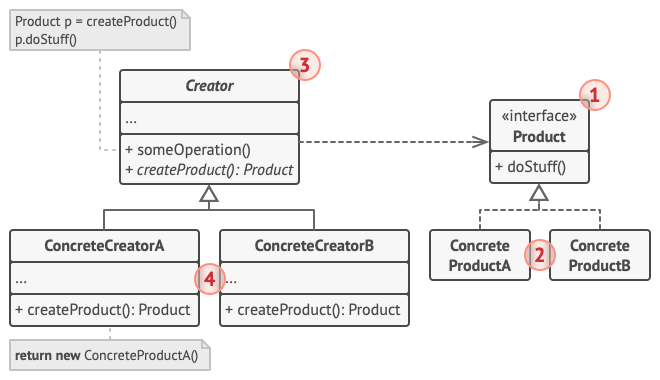

# Factory pattern

## Objetivo
Fornecer uma interface para criar objetos em uma super classe, mas permitir que subclasses alterem o tipo de objetos que serão criados.

Substituir chamadas diretas de construção de objeto por chamadas para um método da fábrica.

É possível lidar com o problema de criar objetos sem precisar especificar a classe exata do objeto que será criado.

## Funcionamento
Criar uma interface para todos os objetos em comum que serão instanciados.

Criar uma interface para a fábrica de objetos, com um método de criação que retorne a interface comum entre os objetos.

Criar a fábrica onde será instanciado um objeto específico, retornar este objeto no método de criação herdado pela fábrica.

Poderá ser criado infinitas fábricas para instanciar diferentes objetos seguindo esse mesmo padrão.

Para criar um objeto basta instanciar a fábrica correspondente e utilizar o método de criação

