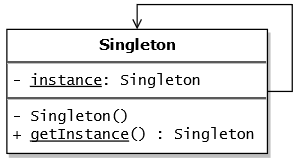

# Singleton pattern

## Objetivo
Permite garantir que uma classe tenha apenas uma instância, enquanto fornece um ponto de acesso global para essa instância.

## Funcionamento

Criar um classe com o construtor padrão privado, evitando que outros objetos usem ***new*** com a classe Singleton.

Criar um método de criação estático que atue como o construtor. Esse método chama o construtor privado para criar o objeto singleton e o salva em um atributo estático. Todas as chamadas a seguir para esse método retornarão este mesmo objeto.

