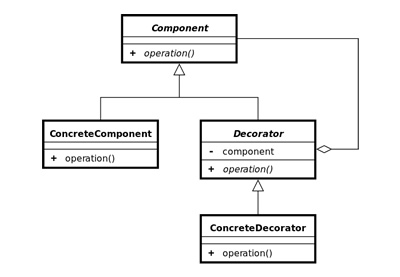

# Decorator pattern

## Objetivo
Permite a adição de comportamento a um objeto individual, tanto estaticamente ou dinamicamente, sem afetar o comportamento de outros objetos da mesma classe.

Usando decoradores, é possível agrupar objetos inúmeras vezes, pois os objetos de destino e os decoradores seguem a mesma interface. O objeto resultante terá um comportamento de empilhamento de todos os decoradores.

## Funcionamento
É criado uma classe componente concreta e definido o comportamento base nela.

É criado uma interface para o **Decorador** permitindo uma ligação entre os componentes concretos e decoradores. Ela deve ter um campo para armazenar uma referência ao objeto envolvido. O decorador base deve delegar todo o trabalho para o objeto envolvido.

Todas as classes devem implementar a interface do componente.

Crie decoradores concretos estendendo-os a partir do decorador base. Um decorador concreto deve executar seu comportamento antes ou depois da chamada para o método pai (que sempre delega para o objeto envolvido).

O código cliente deve ser responsável por criar decoradores e compô-los do jeito que o cliente precisa.

.
