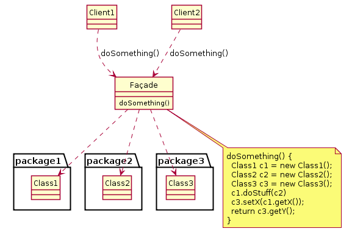

# Facade pattern

## Objetivo

O método Facade fornece uma interface simples para a lógica complexa de um ou vários subsistemas. A Facade delega as solicitações do cliente aos objetos apropriados dentro do subsistema.

A Facade também é responsável por Gerenciando seu ciclo de vida. Tudo isso protege o cliente da complexidade indesejada do subsistema.

## Funcionamento

- Verificar se é possível fornecer uma interface mais simples para o subsistema existente.

- Implementar uma interface em uma classe Facade. Delegando as chamadas para os objetos apropriados do subsistema. Gerenciando seu ciclo de vida.

- Fazer com que todo o código se comunique com o subsistema apenas por meio da Facade. Assim quando um subsistema é atualizado para uma nova versão só é necessário modificar o código na Facade.

.